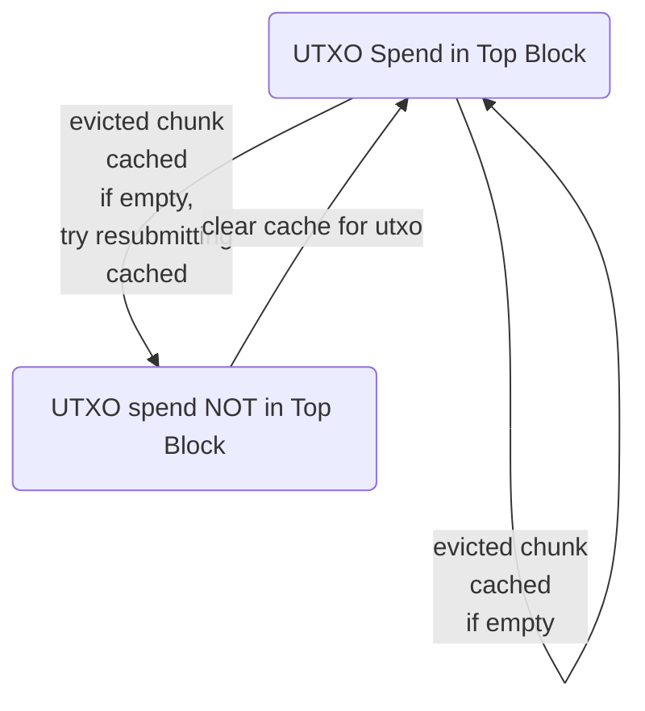

# anticycle
Demo anti-cycle replacement script

https://bitcoinops.org/en/newsletters/2023/10/25/#replacement-cycling-vulnerability-against-htlcs

Requires ZMQ and RPC access to your Bitcoin Core node

Horrifically untested, won't stand up to real attacks
probably, maybe? For now, only tracks/attempts single
tx resubmissions for RBFs. In other words, it will
not attempt CPFP-based fee transaction structures,
though that can be supported in future.

Mostly implementing to see how many times this cycling
seems to be happening in practice to set the cycling
threshhold.

